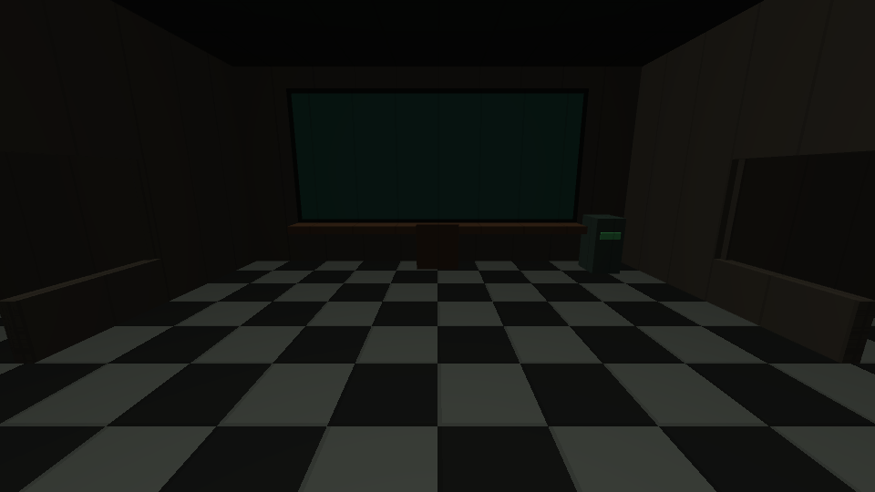
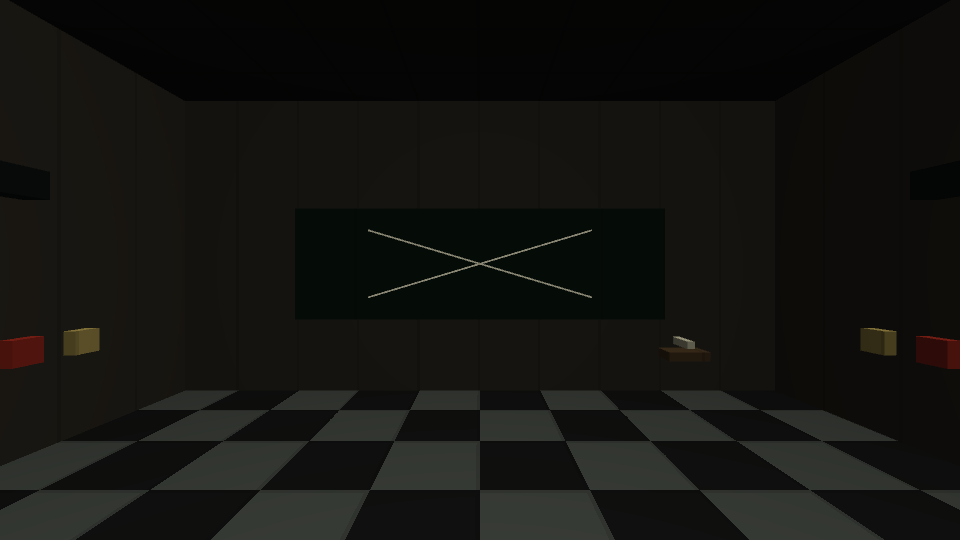

# 관제실 09 시제품

각 관제실은 10×10m이며 앞에는 가로 7m 구역의 큰 화면 하나, 중앙에는 의자, 좌우에는 문·창문·문 스위치·라이트 스위치, 뒤에는 가로 6m 칠판과 매직이 있다. 큰 화면의 실제 CCTV 영상과 조종은 다음 작업으로 남긴다. 천장은 큰 화면을 위해 시험용 4.8m로 높였다.

실제 GPU 화면. 칠판의 X는 캡처 전용 예시이며 일반 판의 칠판은 비어 있다. 라이트는 현재 전용 시제품 셰이더로 복도에 밝은 영역을 만드는 방식이며 최종 그림자 조명은 추후 제작한다.

## 확정된 배터리 규칙

- 각 방 100%. 해당 방에 처음 입장하면 소모 시작하고 떠나도 계속 소모한다. 시작 방은 공동 스폰으로 바로 시작한다.
- 아무 장치도 쓰지 않으면 420초(7분)에 0%. 기본 소모는 초당 100/420%p.
- 문 하나가 닫힌 동안 기본 속도의 1.2배, 두 개가 닫히면 1.4배.
- 라이트 버튼 한 번에 2초. 켜진 라이트 하나당 그동안 기본 속도 0.1배 추가. 문 두 개와 라이트 두 개 사용 시 1.6배.
- 켜져 있는 라이트를 다시 눌러도 시간을 연장하지 않는 시험 구현.
- 0%이면 방어 문은 열리고 라이트는 꺼진다. 소진된 배터리는 복구되지 않는다. 일시 정전·두꺼비집 수리는 아직 없다.
- 배터리·문·라이트 상태는 서버에서 계산해 공유하며 나중에 접속한 플레이어도 현재 상태를 받는다.

## 시험 조작법

`Builds/NetworkTest-09/NightToyStore.exe` 두 창에서 Host / Join. 같은 PC는 127.0.0.1. 1~4 역할 변경은 기존 개발용 기능이다.

- 의자에 가까이 가서 E: 앉기. E: 일어나기. 한 의자는 한 명만 사용한다.
- 앉은 상태 J / L: 좌 / 우 문, U / O: 좌 / 우 라이트. 마우스 시선은 유지된다. 이동과 점프는 앉아 있는 동안 차단한다.
- 다른 플레이어도 문 옆 빨간 스위치 또는 노란 라이트 스위치를 가까이 바라보고 E로 조작한다. 문 입구에 플레이어가 있으면 닫기를 거부하는 시험 안전 처리.
- 칠판 옆 매직에 가까이 가서 E로 집고, 칠판을 바라보며 E로 쓰기 화면을 연다. 마우스 왼쪽 버튼을 누르고 끌어 글씨·그림을 직접 그린다.
- 쓰기 화면에서 Esc 또는 E로 나가기. G로 매직을 원래 받침대로 반환한다. 방마다 매직 하나를 공유한다.
- 칠판 그림은 실제 칠판 면에도 보이고 다른 창·후발 접속자에게 공유된다. 할머니의 쓰기 화면은 검게 가려진 상태로 위치 감각으로 그린다.
- 테니스공은 문·라이트·의자 방어 조종·매직·칠판 쓰기 불가. CCTV만 조종할 수 있다는 최신 기획을 반영한 제한이며 실제 CCTV 조종은 아직 없다. 이전 떠 있는 매직 계획을 대체한다.

열쇠로 관제실을 개방하는 문과 배터리로 닫는 방어 문은 별도 상태다. 잠금 해제는 유지되고 방어 문만 전력 소모 중 닫을 수 있다. 역할 변경·포획·접속 종료 시 점유한 의자와 매직을 반환한다.

현재 외형은 시험용이다. 문 애니메이션·음향·정전·깨진 라이트 수리·괴물 파괴·실제 CCTV·칠판 지우기는 미구현. 그림은 한 세션에 최대 4,000개 선분을 공유하고 새 Host 세션에서 초기화한다. 별도의 저장 파일을 만들지 않는다. 최종 그림 저장·삭제 규칙은 추후 결정한다.

검증 도구: `tools/Verify-ControlRoom.ps1`. 실제 마이크를 사용하지 않는다. 자동 배터리 검증은 시간을 수식으로 진행하므로 7분을 실제로 기다리는 검증과 구분한다.
