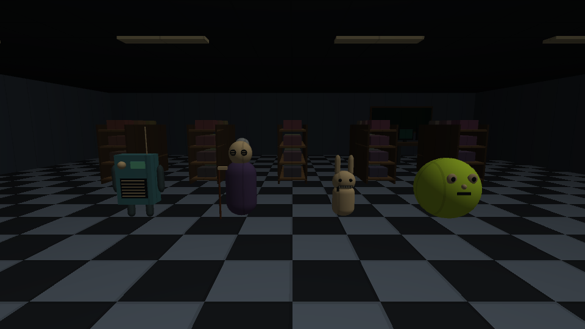

# 첫 인게임 디자인

Unity에서 실제 렌더링한 첫 외형 확인용 이미지. 이미지 생성 도구로 만든 콘셉트가 아니라 게임에서 표시하는 코드 메시다.

- 라디오: 청록색 몸체, 스피커 그릴, 다이얼·표시창, 안테나.
- 할머니: 보라색 옷, 단추 눈, 머리 묶음과 지팡이.
- 토끼: 작은 몸, 긴 귀, 닫힌 지퍼 입.
- 테니스공: 커진 황록색 구체, 보는 방향을 향하는 눈·코·입. 굴림 때문에 시점이 돌지 않음.
- 환경: 체크 타일, 어두운 벽·천장, 진열대와 장난감 상자, 관제실 책상·모니터·칠판 장식.

## 다음 디자인 작업

사용자가 외형 방향을 확인하면 실루엣·재질·낡음 표현을 발전시킨다. 현재 기본 메시 외형은 최종 모델이나 출시 품질을 의미하지 않는다. 얼굴 표정, 애니메이션, 천·플라스틱·펠트 재질, 괴물과 최종 조명은 후속 단계다.
모니터·칠판의 현재 표현은 장식이며 실제 CCTV/그리기 기능은 별도 구현한다.
