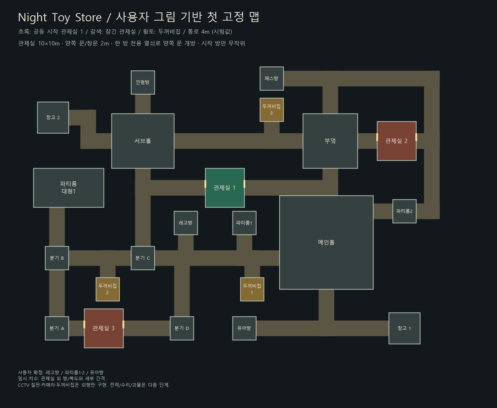
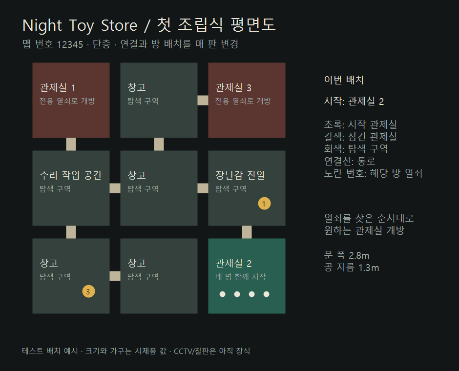

# 맵 시제품

## 2026-10-09 변경: 08 고정 맵

사용자는 우선 직접 그린 고정 맵으로 만들기로 변경했다. 08 실행 파일은 그림에서 읽은 방·복도의 연결을 고정한 첫 구조를 사용한다. 아래 07 버전 랜덤 맵 설명은 기존 시제품 기록이다.

실제 Unity 화면: [전체 구조](map-fixed.png), [관제실 내부](room-fixed.png). 배치 데이터: [fixed-sketch-v1](map-fixed.png.json). GPU 캡처의 핑크 오류 픽셀 0.

- 원본: [관제실](reference/control-room-user.png), [전체 맵](reference/store-user.png).
- 확정 치수 정리: [관제실 평면 기준](control-room-confirmed.svg). 방 10×10m, 좌우 문·창문 가로 2m, 칠판 6m, CCTV 구역 7m, 문 옆 카메라. 높이와 정확한 간격은 미정.
- 각 관제실용 외부 두꺼비집을 수리해 일시 정전을 복구한다. 용량 소진은 복구 불가.
- 시작 관제실 무작위/동일 방 공동 시작 및 전용 열쇠 규칙은 유지. 해당 키로 한 방의 양쪽 문이 함께 개방되며 어느 쪽에서도 E 사용 가능.
- 확인된 이름: 메인홀, 서브홀, 창고1·2, 인형방, 파티룸 대형1, 분기, 관제실1·2·3, 두꺼비집1·2·3, 체스방, 부엌.
- 추가 확인된 이름: 작은 방 A=레고방, B=파티룸1, C=파티룸2, D=유아방. 게임·평면도에 확정 이름 사용.
- 관제실 외 크기는 사용자 승인된 임시 치수. 주 복도 4m, 메인홀 24×24m, 서브홀 16×14m, 부엌 14×14m, 창고 8×8m, 작은 방 6×6m, 분기 6×6m. 전체 약 104×72m이므로 길 찾기 테스트 후 규모 조정 가능. 관제실의 벽 중심선 간격은 10m이며 벽 두께 0.22m는 시험값.
- 두꺼비집 배치: 원본 그림의 오른쪽 위 3번, 왼쪽 아래 1번, 나머지 2번. 현재는 캐비닛 외형/번호만 있으며 수리 기능 없음.
- 문 옆 카메라, CCTV와 칠판은 외형만 구현. 창문은 시야가 통하고 투명 충돌면이 있어 플레이어가 통과하지 못한다.
- F2는 개발용 전체 평면도와 플레이어 위치. 할머니에도 보이는 테스트 도구로 출시 UI가 아님.
- 검증: 30개 시드에서 같은 구조·세 시작 관제실·공개 구역과 열쇠 접근성. 실제 네 프로세스에서 공동 시작, 전용 키, 임의 개방 순서, 양쪽 출입문 공 크기 충돌 여유, 잠금/열쇠 상태 복제와 후발 접속 PASS. tools/Verify-FixedStore.ps1.

## 07 조립식 맵 기록

이미지는 실제 실행에서 추출한 맵 번호 12345의 배치다. 이 예시는 관제실 2에서 시작하지만 새 Host 세션에서는 1·2·3 중 무작위로 결정된다.

## 승인된 규칙

- 단층의 오래된 동네 장난감 가게.
- 네 플레이어가 같은 관제실에서 시작. 시작한 방은 열려 있고 나머지 두 방은 잠김.
- 각 관제실의 전용 열쇠. 찾은 순서에 따라 자유롭게 개방하며 1→2→3 순서 강제 없음.
- 직접 설계한 공간 모듈을 무작위로 배치·연결하는 방식.

## 첫 구현 범위

- 3×3 격자의 9개 모듈. 모듈당 8m, 전체 24×24m는 테스트 크기다.
- 세 관제실을 네 모서리 중 서로 다른 곳에 배치. 시작 관제실, 공개 구역의 연결, 진열·창고·작업 공간 테마와 열쇠 위치를 시드로 결정.
- 공개 구역을 먼저 연결하고 관제실은 막다른 분기로 붙인다. 따라서 잠긴 관제실이 열쇠 탐색 경로를 막지 않는다.
- 모든 필요한 열쇠는 잠긴 방을 통과하지 않고 접근 가능한 공개 구역에 존재.
- 출입구 2.8m, 공 지름 1.3m. 문턱·계단 없이 동일한 바닥 높이.
- E로 근처 전용 열쇠 수거 및 관제실 개방. 서버가 거리·열쇠 종류·수거 상태를 검증한다. 문과 열쇠 상태는 모든 플레이어와 후발 참가자에게 동기화.
- F2는 테스트 평면도. 할머니에게도 보이는 개발용 도구이며 출시용 기능이 아님.
- 열쇠 소지 방식은 사용자 답변 대기. Host 실행 전에 개인 소지/팀 공유 테스트 옵션으로 두 방식을 확인할 수 있다. 개인 소지 모드의 미사용 열쇠는 소지자가 접속을 종료하면 원래 장소에 다시 나타나도록 임시 복구 처리.
- 같은 맵 재현: 실행 인자 `-nts-seed 12345`. 일반 Host 실행은 새 번호를 뽑는다. 아직 밤 진행과 다음 판 화면이 없으므로 현재는 세션 단위로 생성.

## 남은 작업

비정형 방·복도 모듈과 가구 변형, 관제실 전력·방어 문·실제 수리 장치, 물자 회수, CCTV·칠판 기능, 괴물 경로 및 실제 협동 동선 테스트. 현재 작업 공간·모니터·칠판은 장식이며 수리/감시 기능을 뜻하지 않는다.

## 검증

- 2,000개 시드에서 결정성, 세 시작 관제실, 공개 구역 연결, 열쇠 접근 가능성과 배치 다양성 검사 PASS.
- 실제 4개 프로세스: 같은 시작 관제실, 개인 열쇠, 종류가 맞아야 개방, 순서 강제 없는 개방, 열린 문에 대한 공 크기의 물리 통과 여유, 문·열쇠 복제 및 후발 접속 PASS.
- 다른 시드에서 팀 공유 모드도 PASS.
- 실제 GPU 위에서 본 생성 맵 캡처: 핑크 오류 픽셀 0. `overview-12345.png` 및 배치 데이터 `layout-12345.json` 보관.
- 기존 이동·물리·음성·역할 교환 회귀 검증은 명시적인 레거시 테스트 공간에서 수행. 마이크 장치 확인은 사용자 요청대로 추후 두 PC에서 진행.
- 자동 검증은 실제 사용자의 길 찾기·공 운반·공포 체감을 대신하지 않는다.

재검증: `tools/Verify-Store.ps1`, 다른 시드/팀 공유는 `-Seed 98765 -SharedKeys`.
평면도 이미지 재생성: `tools/Export-StorePlan.ps1 -LayoutJson docs/map/layout-12345.json -Output <절대 PNG 경로>`.
